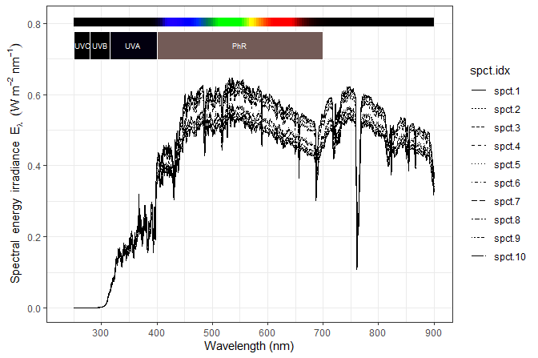

# photobiologySun 

<!-- badges: start -->

[](https://cran.r-project.org/package=photobiologySun)
[](https://cran.r-project.org/web/checks/check_results_photobiologySun.html)
[](https://github.com/aphalo/photobiologySun/actions/workflows/R-CMD-check.yaml)
<!-- badges: end -->

Package ‘**photobiologySun**’ complements other packages in the [*R for
photobiology* suite](https://www.r4photobiology.info/). It contains
spectral data for daylight, including sunlight and shade light. Package
‘photobiologySun’ also includes spectra measured or simulated for
different times of the day, and reference spectra for solar radiation.

This package contains only data. Data are stored as collections of
spectra of class `source_mspct` from package ‘photobiology’, which is
the core of the [*R for photobiology*
suite](https://www.r4photobiology.info/). Spectra can be easily plotted
with functions and methods from package
[‘ggspectra’](https://docs.r4photobiology.info/ggspectra/). The spectra
can be used seamlessly with functions from package
[‘photobioloy’](https://docs.r4photobiology.info/photobiology/).
However, class `source_mspct` is derived from `list` and class
`source_spct` is derived from `data.frame` making the data also usable
as is with base R functions.

## Examples

``` r
library(ggspectra)
library(photobiologySun)
```

How many spectra are included in the current version of
‘photobiologySun’?

``` r
length(gap.mspct)
#> [1] 72
```

``` r
names(gap.mspct)
#>  [1] "spct.1"  "spct.2"  "spct.3"  "spct.4"  "spct.5"  "spct.6"  "spct.7" 
#>  [8] "spct.8"  "spct.9"  "spct.10" "spct.11" "spct.12" "spct.13" "spct.14"
#> [15] "spct.15" "spct.16" "spct.17" "spct.18" "spct.19" "spct.20" "spct.21"
#> [22] "spct.22" "spct.23" "spct.24" "spct.25" "spct.26" "spct.27" "spct.28"
#> [29] "spct.29" "spct.30" "spct.31" "spct.32" "spct.33" "spct.34" "spct.35"
#> [36] "spct.36" "spct.37" "spct.38" "spct.39" "spct.40" "spct.41" "spct.42"
#> [43] "spct.43" "spct.44" "spct.45" "spct.46" "spct.47" "spct.48" "spct.49"
#> [50] "spct.50" "spct.51" "spct.52" "spct.53" "spct.54" "spct.55" "spct.56"
#> [57] "spct.57" "spct.58" "spct.59" "spct.60" "spct.61" "spct.62" "spct.63"
#> [64] "spct.64" "spct.65" "spct.66" "spct.67" "spct.68" "spct.69" "spct.70"
#> [71] "spct.71" "spct.72"
```

``` r
length(sun_reference.mspct)
#> [1] 5
```

What are the names of available spectra. We use `head()` to limit the
output.

``` r
names(sun_reference.mspct)
#> [1] "ASTM.E490.AM0"    "ASTM.G173.direct" "ASTM.G173.global" "Gueymard.AM0"    
#> [5] "WMO.Wehrli.AM0"
```

Summary calculations can be easily done with methods from package
‘photobiology’. Here we calculate photon irradiance. As the spectra are
normalised we pass `allow.scaled = TRUE`,

``` r
q_irrad(sun_hourly_august.spct, scale.factor = 1e6) # umol m-2 s-1
#> # A tibble: 31 × 2
#>    spct.idx            Q_Total
#>    <fct>                 <dbl>
#>  1 2014-08-21 03:30:00    98.9
#>  2 2014-08-21 04:30:00   169. 
#>  3 2014-08-21 05:30:00   564. 
#>  4 2014-08-21 06:30:00   780. 
#>  5 2014-08-21 07:30:00   534. 
#>  6 2014-08-21 08:30:00  1255. 
#>  7 2014-08-21 09:30:00  1889. 
#>  8 2014-08-21 10:30:00  1914. 
#>  9 2014-08-21 11:30:00  1482. 
#> 10 2014-08-21 12:30:00  1264. 
#> # ℹ 21 more rows
```

The `autoplot()` methods from package ‘ggspectra’ can be used for
plotting one or more spectra at a time.

``` r
autoplot(gap.mspct[1:10], annotations = c("-", "peaks")) + 
  theme_bw()
```

<!-- -->

The classes of the objects used to store the spectral data are derived
from `"data.frame"` making direct use of the data with functions and
methods from base R and various packages easy.

## Installation

Installation of the most recent stable version from CRAN:

``` r
install.packages("photobiologySun")
```

Installation of the current unstable version from GitHub:

``` r
# install.packages("devtools")
devtools::install_github("aphalo/photobiologySun")
```

## Documentation

HTML documentation is available at
(<https://docs.r4photobiology.info/photobiologySun/>), including a *User
Guide*.

News on updates to the different packages of the ‘r4photobiology’ suite
are regularly posted at (<https://www.r4photobiology.info/>).

Two articles introduce the basic ideas behind the design of the suite
and its use: Aphalo P. J. (2015)
(<https://doi.org/10.19232/uv4pb.2015.1.14>) and Aphalo P. J. (2016)
(<https://doi.org/10.19232/uv4pb.2016.1.15>).

A book is under preparation, and the draft is currently available at
(<https://leanpub.com/r4photobiology/>).

A handbook written before the suite was developed contains useful
information on the quantification and manipulation of ultraviolet and
visible radiation: Aphalo, P. J., Albert, A., Björn, L. O., McLeod, A.
R., Robson, T. M., & Rosenqvist, E. (Eds.) (2012) Beyond the Visible: A
handbook of best practice in plant UV photobiology (1st ed., p. xxx +
174). Helsinki: University of Helsinki, Department of Biosciences,
Division of Plant Biology. ISBN 978-952-10-8363-1 (PDF),
978-952-10-8362-4 (paperback). PDF file available from
(<https://hdl.handle.net/10138/37558>).

## Contributing

Pull requests, bug reports, and feature requests are welcome at
(<https://github.com/aphalo/photobiologySun>).

## Citation

If you use this package to produce scientific or commercial
publications, please cite according to:

``` r
citation("photobiologySun")
#> To cite package 'photobiologySun' in publications, please use:
#> 
#>   Aphalo, Pedro J. (2015) The r4photobiology suite. UV4Plants Bulletin,
#>   2015:1, 21-29. DOI:10.19232/uv4pb.2015.1.14
#> 
#> A BibTeX entry for LaTeX users is
#> 
#>   @Article{,
#>     author = {Pedro J. Aphalo},
#>     title = {The r4photobiology suite},
#>     journal = {UV4Plants Bulletin},
#>     volume = {2015},
#>     number = {1},
#>     pages = {21-29},
#>     year = {2015},
#>     doi = {10.19232/uv4pb.2015.1.14},
#>   }
```

## License

© 2012-2023 Pedro J. Aphalo (<pedro.aphalo@helsinki.fi>). Released under
the GPL, version 2 or greater. This software carries no warranty of any
kind.
